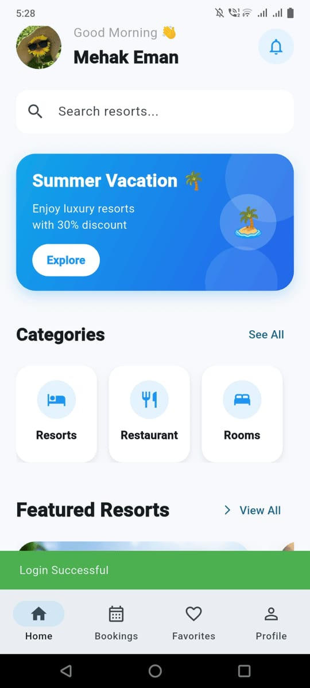
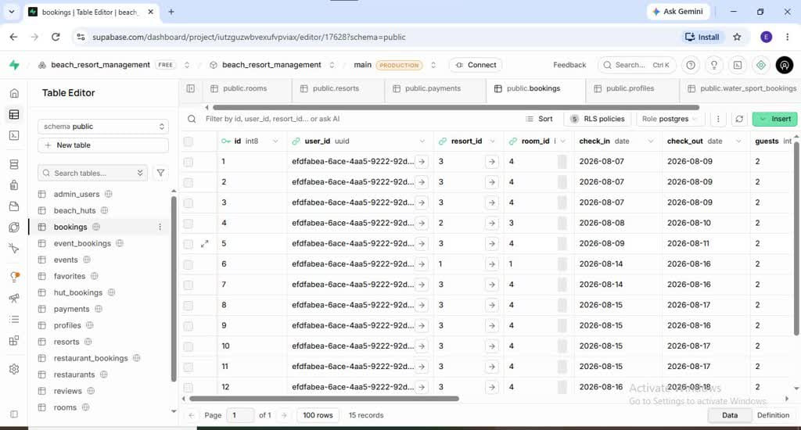
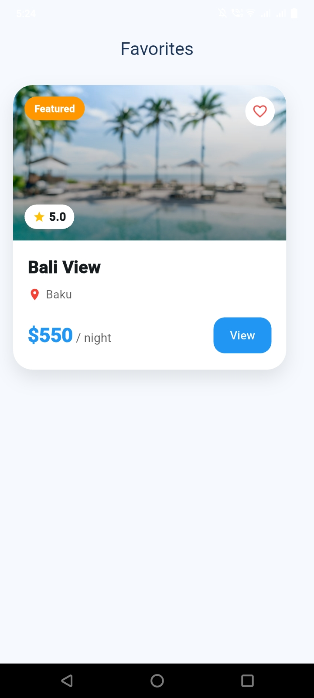

# 🏝️ Beach Resort Management & Booking App

A modern Flutter-based beach resort management and booking application designed to provide users with an easy way to discover resorts, explore rooms, make bookings, manage favorites, and view their booking history.

The project also includes a dedicated Admin Panel for managing users, resorts, bookings, and payments.

## 📱 Project Preview

### Home Screen


### Resort Details


### Booking


### Favorites


### Admin Dashboard


## ✨ Features

### 👤 User Features

- User Sign Up and Login
- Forgot Password
- Browse Resorts
- Search Resorts
- Resort Categories
- Resort Details
- Room Listing
- Room Booking
- Favorite Resorts
- My Bookings
- Profile Management
- Payment Management
- Notifications

### 👨‍💼 Admin Features

- Admin Login
- Admin Dashboard
- Manage Users
- Manage Resorts
- Add Resorts
- Update Resorts
- Delete Resorts
- Manage Bookings
- Approve/Reject Bookings
- Manage Payments
- Update Payment Status

## 🛠️ Technologies Used

- Flutter
- Dart
- Supabase
- PostgreSQL
- Provider
- MVVM Architecture
- GoRouter
- Supabase Authentication
- CRUD Operations
- Git & GitHub

## 🏗️ Architecture

The application follows an organized architecture using:

- Models
- Views / Screens
- ViewModels
- Services
- Repositories
- Supabase backend

## 🗄️ Backend

Supabase is used for:

- Authentication
- PostgreSQL database
- User profiles
- Resorts
- Rooms
- Bookings
- Favorites
- Payments

## 📂 Main Modules

```text
lib/
├── admin/
├── authentication/
├── booking/
├── category/
├── favourite/
├── home/
├── profile/
├── rooms/
├── routes/
├── search/
└── config/
